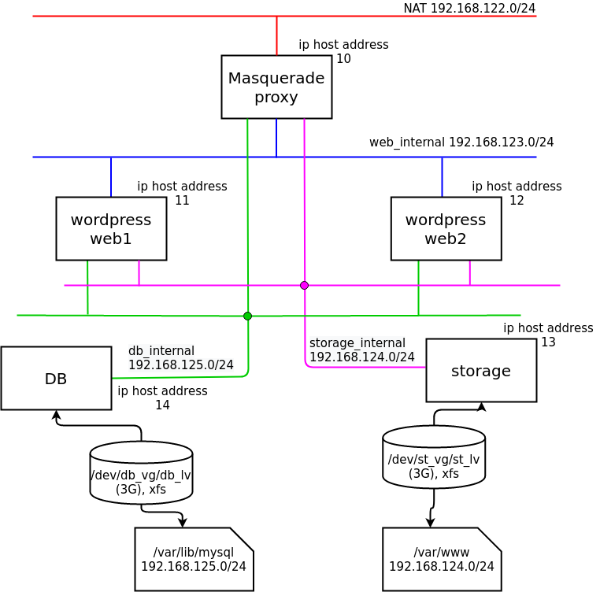
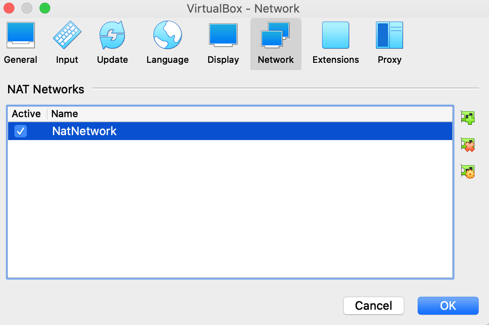

# IP Masquerade Network Configuration

> 목차

1. IP Masquerade 소개
2. 목적
3. 환경
4. Diagram
5. HANDBOOK

> 1) IP Masquerade 소개

NAT(SNAT) 와 비슷한 역할을 하지만 포트포워딩까지 해주는 기능이다. 외부망(인터넷)과 통신 가능한 공인 ip를 가지고 있는 호스트pc를 사용해 내부 사설 네트워크의 pc들이 외부망(인터넷)과 통신할 수 있게 하는 기능이다. Masquerade의 본 뜻인 가면이라는 의미에서 내부 사설 네트워크의 pc들은 공인 ip를 사용하는 호스트의 뒤에 숨어서 외부와 통신하므로 외부에서 직접 접근하지 못해 내부 사설 네트워크의 보안이 향상되며 보다 안전한 네트워크 환경을 구성할 수 있는 기술이다.

> 2) 목적

안전한 내부 네트워크망을 위한 ip masquerade 구성 및 Web, DataBase, Storage 서버 구축 과 공유 디렉토리 연결

> 3) 환경

Host OS : mac OS Catalina 10.15.1
Guest OS : CentOS-7-x86_64-Minimal-2003.iso
Virtual Machine : Oracle VirtualBox 6.1.8
Network1 : nat network(Nat) 10.0.2.15/24(dhcp)
Network2 : web_internal(Host-only Adapter = 'vboxnet0') 192.168.123.0/24
Network3 : storage_internal(Host-only Adapter = 'vboxnet1') 192.168.124.0/24
Network4 : db_internal(Host-only Adapter = 'vboxnet2') 192.168.125.0/24

> 4) Diagram



> 5) HANDBOOK

### 1. 네트워크 구성

- Interface Adapter Setting
    1. 외부망 Nat netwrok 1개(dhcp)
    2. 내부망 Host-only network 3개(manually)

        Adapters

        - 'vboxnet0' 123 번 대역 : web server
        - 'vboxnet1'  124 번 대역 : storage server
        - 'vboxnet2' 125 번 대역 : db server

    **Vbox > Preferences > network**

    

    **Vbox > File > Host Network Manager**

    

- Proxy Server Network Setting
    - 외부망 NAT network 인터페이스 1개 사용
    - 내부망 host-only network 인터페이스 3개 사용

    **IP Setting)**

    ```
    **외부망, NAT network**
    eth0 : 10.0.2.15/24 (eth0)

    **내부망, host-only network**
    eth1 : 192.168.123.10/24(web_internal)
    eth2 : 192.168.124.10/24(storage_internal)
    eth3 : 192.168.125.10/24(db_internal)
    ```

    **VirtualBox Manager)**

    

    **Terminal)**

    

- Web1, Web2 Server Network Setting

     **web1**

    - 내부망 host-only network 3개 사용
    - web_internal 의 gateway로  proxy서버 등록

    **IP Setting)**

    ```
    **내부망, host-only network**
    eth0 : 192.168.123.11/24, gw: 192.168.123.10 (web_internal)
    eth1 : 192.168.124.11/24(storage_internal)
    eth2 :  192.168.125.11/24(db_internal)
    ```

    **Vbox Manager)**

    

    **Terminal)**

    

    web2)

    192.168.{123,124,125).12 번 대역, web1과 환경 동일, ip 주소만 다름

- Storage Server Network Setting
    - 내부망 host-only network 1개 사용
    - storage_internal 의 gateway로  proxy서버 등록

    **IP Setting)**

    ```
    **내부망, host-only network**
    eth1 : 192.168.124.13/24, gw : 192.168.124.10 (storage_internal)
    ```

    **VirtualBox Manager)**

    

    **Terminal)**

    

- DB Server Network Setting
    - 내부망 host-only network 1개 사용
    - db_internal 의 gateway로  proxy서버 등록

    **IP Setting)**

    ```
    **내부망, host-only network**
    eth1 : 192.168.125.14/24, gw : 192.168.125.10 (db_internal)
    ```

    **VirtualBox Manager)**

    

    **Terminal)**

    

(* 모든 호스트 SELinux disabled 상태로 진행함 >> /etc/selinux/config 에서 SELINUX=disabled 로 수정)

### 2. Proxy 서버에 IP Masquerade 적용 (내부 ↔ 외부 통신 Setting)

**1) Proxy Server 방화벽 규칙 설정**

1.  Masquerade 활성화

    ```
    proxy# firewall-cmd --chagne-interface=eth1 --zone=external
    proxy# firewall-cmd --chagne-interface=eth2 --zone=external
    proxy# firewall-cmd --chagne-interface=eth3 --zone=external
    ```

2.  NAT 인터페이스로 eth0 지정

    ```
    proxy# firewall-cmd --direct --add-rule ipv4 nat POSTROUTING 0 -o eth0 -j MASQUERADE
    ```

3.  In: eth{1,2,3} -> Out: eht0

    ```
    proxy# firewall-cmd --direct --add-rule ipv4 filter FORWARD 0 -i eth1 -o eth0 -j ACCEPT
    proxy# firewall-cmd --direct --add-rule ipv4 filter FORWARD 0 -i eth2 -o eth0 -j ACCEPT
    proxy# firewall-cmd --direct --add-rule ipv4 filter FORWARD 0 -i eth3 -o eth0 -j ACCEPT
    ```

4.  응답 패킷의 허용

    ```
    proxy# firewall-cmd --direct --add-rule ipv4 filter FORWARD 0 -i eth0 -o
    eth1 -m state --state RELATED,ESTABLISHED -j ACCEPT
    proxy# firewall-cmd --direct --add-rule ipv4 filter FORWARD 0 -i eth0 -o
    eth2 -m state --state RELATED,ESTABLISHED -j ACCEPT
    proxy# firewall-cmd --direct --add-rule ipv4 filter FORWARD 0 -i eth0 -o
    eth3 -m state --state RELATED,ESTABLISHED -j ACCEPT
    ```

**2) Web, Storage, DB Server 설정**

1.  외부 통신 확인

    ```
    web1# ping 8.8.8.8
    web2# ping 8.8.8.8
    storage# ping 8.8.8.8
    db# ping 8.8.8.8
    ```

2.  DNS 등록

    ```
    web1# nmcli con mod web_internal ipv4.dns 8.8.8.8
    web1# nmcli con mod web_internal ipv4.method manual
    web1# nmcli con up web_internal

    web2, storage, db 서버 동일
    ```

### 3. 패키지 설치 및 서비스 구성

**1) Web ↔ Storage NFS MOUNT**

- W**eb1,2**
    1. httpd service 설치

        ```
        web1,2 ~# yum install -y httpd
        web1,2 ~# systemctl start httpd
        web1,2 ~# systemctl enable httpd
        web1,2 ~# firewall-cmd --permanent --add-service=http
        web1,2 ~# firewall-cmd --reload
        ```

    2. nfs setting

        ```
        web1,2 ~# yum install -y nfs-utils.x86_64
        web1,2 ~# systemctl start nfs
        web1,2 ~# systemctl enable nfs
        web1,2 ~# vi /etc/fstab
        		...
        		192.168.124.13:/var/www /var/www        nfs     defaults,sec=sys        0 0
        web1,2 ~# mount -a
        ```

- S**torage**
    1. httpd service 설치

        ```
        storage ~# yum install -y httpd
        storage ~# systemctl start httpd
        storage ~# systemctl enable httpd
        ```

    2. 마운트 포인트 /var/www 디렉토리 백업

        ```
        storage ~# tar -czf httpd.gzip /var/www/*
        ```

    3. 디스크 파티셔닝 & mount & tar unzip

        ```
        storage ~# fdisk /dev/sdb
        storage ~# pvcreate /dev/sdb1
        storage ~# vgcreate st_vg /dev/sdb1
        storage ~# lvcreate -n st_lv -L 3G st_vg
        storage ~# mkfs.xfs /dev/st_vg/st_lv
        storage ~# vi /etc/fstab
        		...
        		UUID=57d116bd-2383-48b5-8914-4717eebc13e2	/var/www	xfs	defaults	0 0
        storage ~# mount -a
        storage ~# cp httpd.gzip /var/www/
        storage www# tar -xzf httpd.gzip
        ```

    4. nfs setting

        ```
        storage ~# yum install -y nfs-utils
        storage ~# vi /etc/exports
        		/var/www        192.168.124.0/24(rw,sync,sec=sys,no_root_squash)
        storage ~# systemctl start nfs
        storage ~# systemctl enable nfs
        storage ~# firewall-cmd --permanent --add-service=nfs
        storage ~# firewall-cmd --reload
        ```

**2) Web ↔ DB NFS MOUNT & MariaDB + WordPress**

- **Web1,2**
    1. apache 설치→ 위에서 완료
    2. php 설치(web1, web2 동일)

        참고 : [https://rpms.remirepo.net/](https://rpms.remirepo.net/)

        ```
        web1 ~# yum install https://dl.fedoraproject.org/pub/epel/epel-release-latest-7.noarch.rpm
        web1 ~# yum install https://rpms.remirepo.net/enterprise/remi-release-7.rpm
        web1 ~# yum install -y yum-utils
        web1 ~# yum-config-manager --enable remi-php74
        web1 ~# yum install -y php php-mysql
        web1 ~# systemctl restart httpd
        ```

    3. Wordpress 설치

        1) 설치 파일 다운로드

        ```
        web# curl -o latest.tar.gz https://wordpress.org/latest.tar.gz
        ```

        2) 파일 압축 해제

        ```
        web# tar xzf latest.tar.gz
        ```

        3) wordpress 파일 /var/www/html 로 복사

        ```
        web# cp -r wordpress/* /var/www/html/
        ```

        4) /var/www/html에 apache 사용자로 소유자 변경

        ```
        web# chown apache: /var/www/html
        ```

- **DB**
    1. 디스크 파티셔닝 & 마운트

        ```
        db ~# fdisk /dev/sdb
        db ~# pvcreate /dev/sdb1
        db ~# vgcreate db_vg /dev/sdb1
        db ~# lvcreate -n db_lv -L 3G db_vg
        db ~# mkfs.xfs /dev/db_vg/db_lv
        db ~# mkdir -p /var/lib/mysql //package 설치전 마운트 포인트 디렉토리 미리 생성
        db ~# vi /etc/fstab
        		...
        		UUID=f13e5c9c-4885-47f2-ba70-ca9d9ae9ac23       /var/lib/mysql  xfs     defaults        0 0
        db ~# mount -a
        ```

    2. nfs setting

        ```
        db ~# yum install -y nfs-utils
        db ~# vi /etc/exports
        		/var/lib/mysql        192.168.125.0/24(rw,sync,sec=sys,no_root_squash)
        db ~# systemctl start nfs
        db ~# systemctl enable nfs
        db ~# firewall-cmd --permanent --add-service=nfs
        db ~# firewall-cmd --reload
        ```

    3. MariaDB 준비

        참고: [https://mariadb.org/download/](https://mariadb.org/download/)

        ```
        db ~# vi /etc/yum.repos.d/mariadb.repo
        [mariadb]
        name = MariaDB
        baseurl = http://yum.mariadb.org/10.4/centos7-amd64
        gpgkey=https://yum.mariadb.org/RPM-GPG-KEY-MariaDB
        gpgcheck=1

        db ~# yum install -y MariaDB-server
        db ~# systemctl start mariadb
        db ~# systemctl enable mariadb
        db ~# firewall-cmd --add-service=mysql
        db ~# firewall-cmd --add-service=mysql --permanent
        db ~# mysql_secure_installation //root 비밀번호 생성
        ```

    4. wordpress 데이터베이스 준비

        ```
        MariaDB [(none)]> CREATE DATABASE wordpress;
        MariaDB [(none)]> GRANT ALL PRIVILEGES ON wordpress.* TO
        wordpress@'192.168.125.%' IDENTIFIED BY 'dkagh1.';
        MariaDB [(none)]> FLUSH PRIVILEGES;

        (* wordpress@'192.168.125.%' : 현재 DB서버는 192.168.125 대역을 쓰고 있으므로 이와 같이 설정
        만약 다른 대역일 경우 수정하면 됩니다.
        ```

### 4. 확인

- **웹브라우저 에서 접속**

    ```jsx
    [http://web서버주소/wp-admin/install.php](http://xn--web-5f1nx7pitap03b/wp-admin/install.php)
    ```

    아래 화면 나올시 완성, 이후 워드프레스 메뉴얼 대로 사이트 편집

    

    web1(192.168.123.11) 으로 접근한 모습

    

    web1(192.168.123.11) 로 접근

    

    web2(192.168.123.12) 로도 접근 가능
